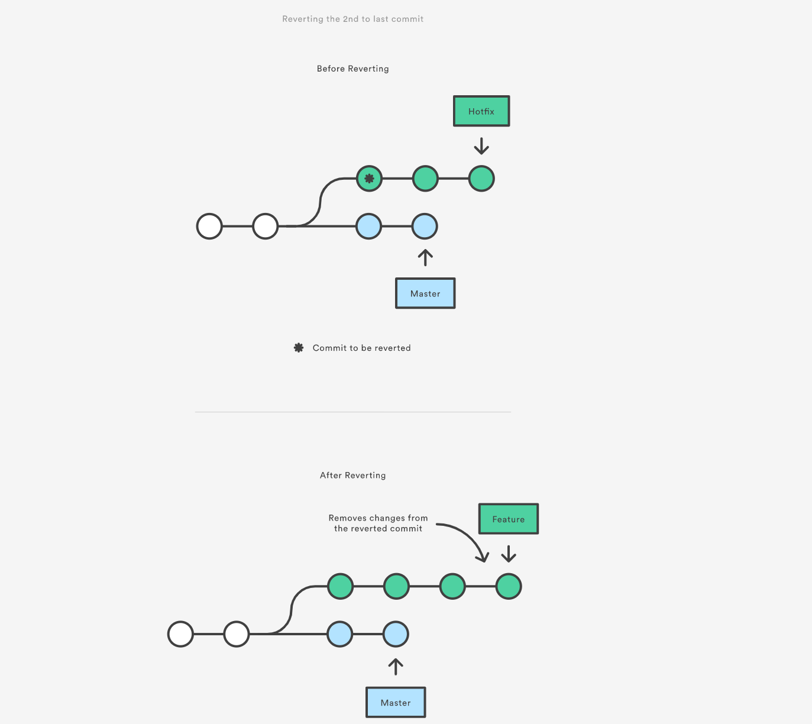
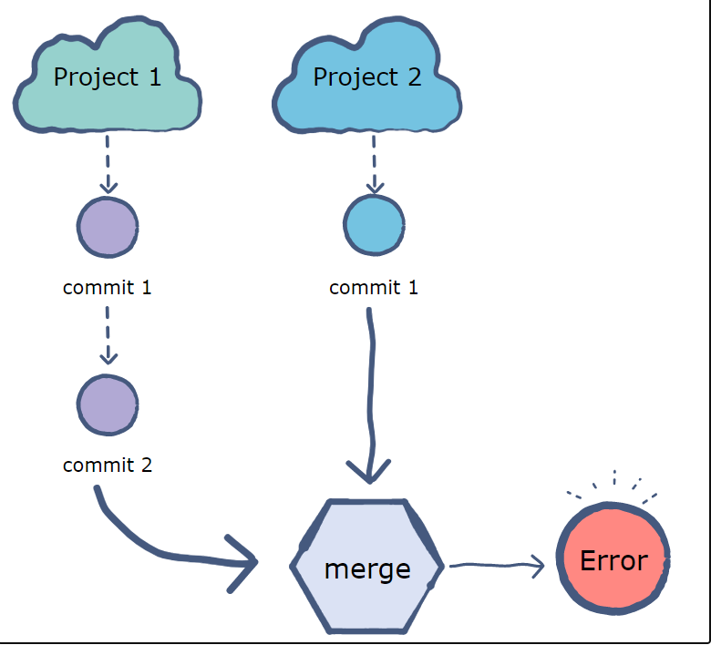

# Git and Github Practice on project use

## why this?
In my first work with git, I feel confused frequently. Even though I study some online course about git and github, and I believe I'm clear with basic git and github conception such as branch, merge, pull, push, remote, etc, problems keep coming up in real world use of git, expecially when I'm in charge of a production, which has multiple stages(production, dev, new_feature, etc), so I need to switch from stage to stage, from version to version to meet production and development requirement. So I thought why don't I conculde how to use git in practice and list some real world scenario that every software engineer may face in their work.  Hope it help me to clear my mind and help readers like you.

## 1.new project
### create a new project
To create a project, we need to create two parts: 
1. local repository
2. github repository \
and linked them by 
open command shell and go to your local project folder and type： \
`git init` to initate git \
`git add .` to add all files in this folder to git \
`git commit -m "write things you want to commit here"` to commit \
`git remote add origin https://github.com/username/projectname.git` to link local git to remote repository\
then you can check if you typeing github url correctly by typing:\
`git remote -v`\
if everything goes well, you can push your code to github now, by typing:\
`git push origin master`  

### link an exsiting local project to github
You may already have a pretty good project and you want to upload to github, in that condition, you can do: 
1. create a repository in github by click the top bar `+` icon --> `New repository` and give your project name and distription and click create repository
2. copy the HTTP url in the top Quick setup such as `https://github.com/dukesky/git_command_for_work.git`
3. go to your local project dir, open command shell type: \
`git init` \
`git add .` \
`git commit -m "write things you want to commit here"`\
`git remote add origin https://github.com/your_account/your_project.git` \
`git push origin master`

job done!

### Clone a github project to local
To clone a github repo to local, you can run:\
`git clone https://github.com/user_name/repo_name.git` \
If you want to clone a specific branch, you can run:\
`git clone -branch <branch_name> https://github.com/user_name/repo_name.git`

## 2.commit
### commit change in local branch
After we change some code in local repository, we may want to update to github, in command line, go to project folder, input \
`git status` to check what has been changed since last commit \
`git add .` to add all changed file, also can use `git add file_name` to add single file \
`git commit -m "write what you want to describe this commit"` \
`git push origin master` to push to github master branch

### backward and forward version in local and github
1. use `checkout`\
When you have committed your work several time, you may want to trace back to previous version, use `git checkout` 
to go back to a specific previous step.
```sh
# see previous commit record, and copy the [SHA-1] code
git log
# to jump to specific commit 
git checkout <SHA-1>
# to jump to prevous 2 steps before
git checkout HEAD~2
# or you can just change single file to previous stage by
git checkout HEAD~2 foo.py
```

2. use `reset HEAD`
```sh 
# reset commit
git reset HEAD~3
# reset file
git reset HEAD~2 foo.py

```

3. use `revert`\
A revert is an operation that takes a specified commit and creates a new commit which inverses the specified commit. git revert can only be run at a commit level scope and has no file level functionality.


A comparation of these three methods please see this blog [Resetting, Checking Out & Reverting](https://www.atlassian.com/git/tutorials/resetting-checking-out-and-reverting)

The conclusion is:\
Checkout and reset are generally used for making local or private 'undos'. They modify the history of a repository that can cause conflicts when pushing to remote shared repositories. Revert is considered a safe operation for 'public undos' as it creates new history which can be shared remotely and doesn't overwrite history remote team members may be dependent on.

Command | Scope | Common use Case 
-- | -- | -- 
git reset|  Commit-level | Discard commits in a private branch or throw away uncommited changes
git reset | File-level | Unstage a file
git checkout | Commit-level | Switch between branches or inspect old snapshots
git checkout | File-level | Discard changes in the working directory
git revert | Commit-level | Undo commits in a public branch
git revert | File-level | NA
## 3.branch
### create a new branch
To create a new branch, simple with:\
`git branch <new_branch_name>`
Or you can go with:\
`git checkout <new_branch_name>` \
witch will create a new branch if git not detect the input branch name and switch to this branch
### push branch to github
When you have some work on a new branch, you may want to:
#### 1.push existing branch to github
This is easy, simply:\
`git push <remote> <branch>`
#### 2.push new branch to github
This is the same as add a new branch to github. To setup remote branch, we can use upstream. First checkout to branch, and: \
`git push -u <remote> <branch>` to push local branch to remote new branch with name <branch>

#### 3.push branch to another remote branch
`git push <remote> <local_branch>:<remote_branch>`
### delete branch
If you want to delete a branch, use:\
`git branch -d <branch_name>`
If you want to delete remote branch:\
`git push <remote> --delete <delete_branch_name>` 


## 4.merge
### merge branch to master in local 
After some work on new-branch, we need to merge our branch to master branch in order to keep the master in the newest track. First, we make sure our work on `new-branch` has been commited, then:
```sh
git checkout master
git merge new-branch
```

### merge local branch to remote when remote master also change
```sh
# checkout to the right local branch you want to push
git checkout new-branch
# push to the remote. 
# If you are publishing a local branch for the first time(new branch) on a remote, the "-u" option is helpful. It makes sure that a tracking connection between the local and the newly created remote branch is established:
git push -u <remotename> <branchname>
```

### merge a local clone repository to github branch/master
same as merge local branch to remote

### merge a local download repo to github (refuseing to merge unredated histories)

This problem sometimes happened when you restart a previous work last update long time ago or just download the whole repo from github and want to push to original remote repo, however you download it without generate git history log (you should actually use `git clone` to download and work).The log is like:
```
fatal: The current branch master has no upstream branch.
To push the current branch and set the remote as upstream, use
git push --set-upstream origin master
```
To solve this problem, you can simple use
```sh
git push/pull <remotename> <branchname> --allow-unrelated-hostories
```
But Why?\
\
To understand the reason, I find this [blog](https://www.educative.io/edpresso/the-fatal-refusing-to-merge-unrelated-histories-git-error). 

So basically, we are like working in two totally different project and aimed to merge this two without any shared branch together (or maybe they have mismatching commit history) As for me, the normal situation is **I have created a new repository (by download from the repo), and init the git repo, added a few commits to it, and  trying to pull/push from a remote repository that already has some commits of its own. Git will also throw the error in this case, since it has no idea how the two projects are related.**


### merge a remote branch to local repo
use `git pull` or `git fetch` follow with `git rebase`, for detail please see Case Example 3

### branch change
1. [Cherry-pick](https://git-scm.com/docs/git-cherry-pick)
Cherry-pick apply some change introduced by existing commits
2. 


## 5.rebase
`git rebase` Reapply commits on top of another base tip.\
So it is good to use `git rebase` after `git fetch` when want to MUST apply new change in remote/branch (detail please see Case 3)
`rebase` and `merge` are similar, please check this [blog](https://medium.com/datadriveninvestor/git-rebase-vs-merge-cc5199edd77c#:~:text=Rebasing%20and%20merging%20are%20both,branch%20but%20in%20different%20ways.&text=When%20you%20do%20rebase%20a,to%20master%20branch's%20ending%20point.&text=Merging%20adds%20a%20new%20commit%20to%20your%20history.) if you want more detail on this two commands

## 6.status
### check local status
1. check which file has been changed since last commit (remember to save file before check) \
 `git status`
2.  check difference between two branch : \
`git diff branch1..branch2`
3. show commit history or show commit history each commit in one line (shorter version) \
`git log` or `git log --oneline` 
4. check what branches are in local and which is current branch, or for more details \
 `git branch` or `git branch -vv`


### check remote(github) status
1. show all remote references (pointers)  \
`git ls-remote` 
2. show all remote branches \
`git remote show`
3. show specific branch information \
`git remote show origin`


## 7.setup 
### setup local 
1.  set git variable \
`git config --global alias.variablename "command you want to write down"`\
, then you can use it by \
 `git variablename` 
2. delete local branch \
`git branch -d localBranchName`

### setup remote 
1. setup upstream branch \
`git push --set-upstream <remote> <branch>` or `git push -u <remote> <branch>` 
2. create a new local branch and link to existing remote branch (origin/branch)\
`git checkout --track origin/branch` 
3. link an existing local branch to remote branch (origin/branch)\
`git branch -u <remote>/<branch>`
4. delete remote branch\
`git push origin --delete remoteBranchName`

## 8.reference
1. [git document](https://git-scm.com/book/en/v2) official git guide
2. [Bitbucket](https://www.atlassian.com/git/tutorials): It is a tutorial appeared frequently in my git search, it has clear guide and detail example to illustrate git problems if you don't want spend too much time on git document


# Some case example 
### 1. work on a new project
``` sh
# create a new directory, and initialize it with git-specific functions
git init my-repo

# change into the `my-repo` directory
cd my-repo

# create the first file in the project
touch README.md

# git isn't aware of the file, stage it
git add README.md

# take a snapshot of the staging area
git commit -m "add README to initial commit"

# provide the path for the repository you created on github
git remote add origin https://github.com/YOUR-USERNAME/YOUR-REPOSITORY.git

# push changes to github
git push --set-upstream origin master


``` 
you can write you project now!

### 2. work on a existing project and make contribution on branch
``` sh
# download a repository on GitHub.com to our machine
git clone https://github.com/user_name/project_name.git

# change into the `repo` directory
cd project_name

# create a new branch to store any new changes
git branch my-branch

# switch to that branch (line of development)
git checkout my-branch

# make changes, for example, edit `file1.md` and `file2.md` using the text editor

# stage the changed files
git add file1.md file2.md

# take a snapshot of the staging area (anything that's been added)
git commit -m "my snapshot"

# push changes to github
git push --set-upstream origin my-branch
```


### 3. work with other teammate/ update clone repo on same branch
when work with your teammate on the same code, or your want to update the repo you clone from others, each time your start work, you should use: \
`git fetch remotename` \
To grabs all the new remote-tracking branches and tags without merging those changes into your own branches.\
`git merge remotename/branchname`\
this merge is merging a remote-tracking branch(i.e., a branch fetched from a remote repository)
or we can use\
`git rebase remotename/branchname`\
takes new commits from the branch `branchname`, and inserts them "under" your changes. More precisely, it modifies the history of the current branch such that it is based on the tip of `branchname`, with any changes you made on top of that.

### 4. a good example of multiple branch co-work together
[Git branching basic branching and merging](https://git-scm.com/book/en/v2/Git-Branching-Basic-Branching-and-Merging)\
this also list ways to solve conflits when merging

#### some tips there：
when you want to keep your local code update, you can use `git pull <remote> <branch>`
however, there's always a better way to use `git fetch` with a `git merge <remote> <branch>`.\
The difference between `git pull` and `git fetch` is that `git pull` directly update your local code by remote repository code, however, `git fetch` will load the remote repositorry code, but not merge is to your local code, so it is like a middle step of update your code, after fetch you have some space the check the difference between local and remote code by \
`git diff <local_branch> <remote>/<remote_branch>`  \
and if you decide to update to remote version, just type: \
`git merge <local_branch> <remote>/<remote branch>`\
All in all, update by pull:
``` sh
git pull <remote> <branch>
```
update by fetch:
``` sh
git fetch
# (add command to test if you need to update)
git merge <remote>/<branch>
```


### 4. 


## Thanks!
:grinning:	